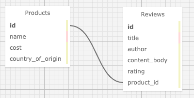

# _Mario's International Food Emporium_ :convenience_store:  

_16 October 2020_

#### _Website for viewing food products and corresponding reviews_

#### By _**Vanessa Stewart**_

## Table of Contents
1. [Description](https://github.com/vanmars/specialty_food_store#description)
2. [Specifications](https://github.com/vanmars/specialty_food_store#specifications)
3. [Database Tables](https://github.com/vanmars/specialty_food_store#data-visualization)
4. [Setup/Installation Instructions](https://github.com/vanmars/specialty_food_store#setupinstallation-requirements)
5. [Known Bugs](https://github.com/vanmars/specialty_food_store#known-bugs)
6. [Further Exploration Tasks](https://github.com/vanmars/specialty_food_store#support-and-contact-details)
7. [Support and Contact Details](https://github.com/vanmars/specialty_food_store#support-and-contact-details)
8. [Technologies Used](https://github.com/vanmars/specialty_food_store#technologies-used)
9. [Photo Credits](https://github.com/vanmars/specialty_food_store#photo-credits)
10. [License](https://github.com/vanmars/specialty_food_store#license)

## Description

_This is a Friday project for Epicodus to demonstrate mastery setting up a Rails project with Active Record. The original instructions include:_

You're in the running for a freelance development job as the developer for Mario's Speciality Food Products (or another fictional company of your choosing). First, Mario wants to make sure you're the right person for the job. He's asked you for an MVP and wants it by 5:00 tonight. The stakes are higher than usual, since Mario's old site had thousands of unique visitors each day. If you can get the job, this is a great way to increase your profile as a developer.

In particular, Mario is concerned about the information in his database being correct; your goal for today is to have the most comprehensive validations and callbacks to ensure information is properly saved and formatted in the database.

Database
The site should have functionality to review products so your database should include a one-to-many relationship between Products and Reviews. All products must have a name, cost and country_of_origin. All reviews should have an author, content_body and rating. (A rating can be a number between 1 and 5.) You can include other fields of your choosing as well.

Landing Page
The landing page should include basic information about the company and should allow users to easily navigate to other areas of the site. This page should also include the three most recently added products and the product with the most reviews. See more information in the Scopes section below.

Products
The site needs to include a products section with a list of the tasty products that Mario sells. Each product should be clickable with a detail view.

Users should be able to add, update and delete new products. Don't worry about user authentication. Assume everyone who visits the site is an admin for now.
Users should be able to click an individual product to see its detail page. (You will not be expected to show the product's average rating. That's included in the further exploration section.)
Users should be able to add a review to a product.
Validations
Your site should include validations for the following:

All fields should be filled out, including rating.
Rating can only be an integer between 1 and 5.
The review's content_body must be between 50 and 250 characters.
Callbacks
Your site should include a callback for the following:

All products are automatically titleized (first letter of each word capitalized) before they are saved to the database.
Seeding
Your project should include seed data for 50 products and 250 reviews. Use Faker with a loop to seed the database.

## Specifications
| Spec     | Behavior | 
| -------- | -------- | 
| 1 | Site includes one-to-many relationship between products and reviews. |
| 2 | Product model includes following properties: name, cost, and country-of-origin. | 
| 3 | Review model includes following properties: author, content_body, and rating. | 
| 4 | Full CRUD functionality for products. | 
| 5 | Full CRUD functionality for reviews. |
| 6 | Landing page includes basic information about the company and allows users to easily navigate to other areas of the site. Page also includes scope methods for displaying the three most recently added products and the product with the most reviews.   |  
| 7 | Site includes a product section with clickable detail views. |
| 8 | Product detail pages should contain details about the product and allow users to add a review.  | 
| 9 | Includes Validation: All fields should be filled out, including rating.|  
| 10 | Includes Validation: Rating can only be an integer between 1 and 5. | 
| 11 | Includes Validation: The review's content_body must be between 50 and 250 characters.| 
| 12 | Includes Callback: All products are automatically titleized (first letter of each word capitalized) before they are saved to the database.| 
| 13 | Seeding: Includes seed data for 50 products and 250 reviews. Uses Faker with a loop to seed the database.| 
| 14 | Includes throrough unit and integration test coverage. | 
| 15 | Routes follow proper convention, including root route. | 
| 16 | Flash success and error messages for creating, updating, and deleting products and reviews present. |

## Database Tables Visualization

## Setup/Installation Requirements
**To View Project**
* Open a web browser of your choice and navigate to the following page: COMING SOON!

**To Extend Project**
1. Install Rails
- For this project, you will need Ruby. Follow the directions [here](https://www.learnhowtoprogram.com/ruby-and-rails/getting-started-with-ruby/ruby-installation-and-setup) for setting up Ruby.
- Install Rails on your machine with the following terminal command `gem install rails -v 5.2.0`

2. Clone Repo and Install Bundler
- Navigate to the directory on your local computer where you would like to clone this repo.
- Clone this repo using the `git clone` command in terminal/command line.
- Navigate to the cloned folder and run `gem install bundler` to install Bundler, which will mange all gem installations for our project.
- Run `bundle` or `bundle install` in your command line to download all dependencies. (If you add additional gems later, you will need to run `bundle update <gem name>`.)

3. Set Up Database
- Run `rake db:setup` in the terminal. This is akin to running the following rake tasks all at once: db:create(creates the dev and test databases for the current env), db:schema:load (recreates the database from the schema.rb file), and db:seed (runs the db/seed.rb file).

4. Open in Text Editor
- Open the cloned repo in a text editor of your choice.
- To Run Tests: While in the root directory of this project, run `rspec` in your command line.
- To Run the App in Browser: While in the root directory of the project, run `rails s` in the terminal. This will start a server, which you can access by entering `localhost:3000` in your browser.

## Known Bugs

_No known bugs at this time._

## Items to Improve
- Refactor integration tests (add a before each method to refrain from having to instantiate a new product and review before every test)
- Add a partial for the repeated navigation bar code in views
- Fix money display so that when the second decimal is a 0, it still displays
- Run check of user inputs, and insert \ before any '

## Further Exploration Tasks
- Add scopes to display the following information on the site: All products made in the USA for buyers that want to buy local products.
- Paginate products so a page of results will only show ten products at a time.
- Allow users to group products by a country of origin of their choice.
- Add a 'featured' boolean so admins can choose which products they'd like to feature.
- Show the average rating for each product.
- Add a scope to retrieve the products with the highest average rating.
- Change the ratings system so stars (or another icon) are used instead of a number.
- Add Images throughout the site, including images for Products. You can use URLs (easiest) or use the Paperclip gem (which we'll be covering next week).
- Jump ahead to next week and add user authentication to your site.
- Make it look nice with styling!

## Support and Contact Details

_Connect with me at vamariestewart@gmail.com with ideas to improve this project._

## Technologies Used

* HTML
* CSS/Bootstrap
* JavaScript/jQuery
* Ruby
* Rails

## Photo Credits
Orange Photo by <a href="https://unsplash.com/@runblue?utm_source=unsplash&amp;utm_medium=referral&amp;utm_content=creditCopyText">Xiaolong Wong</a> on <a href="https://unsplash.com/s/photos/international-food?utm_source=unsplash&amp;utm_medium=referral&amp;utm_content=creditCopyText">Unsplash</a>

### License

Copyright (c) 2020 **_Vanessa Stewart_**

Permission is hereby granted, free of charge, to any person obtaining a copy of this software and associated documentation files (the "Software"), to deal in the Software without restriction, including without limitation the rights to use, copy, modify, merge, publish, distribute, sublicense, and/or sell copies of the Software, and to permit persons to whom the Software is furnished to do so, subject to the following conditions:

The above copyright notice and this permission notice shall be included in all copies or substantial portions of the Software.

THE SOFTWARE IS PROVIDED "AS IS", WITHOUT WARRANTY OF ANY KIND, EXPRESS OR IMPLIED, INCLUDING BUT NOT LIMITED TO THE WARRANTIES OF MERCHANTABILITY, FITNESS FOR A PARTICULAR PURPOSE AND NONINFRINGEMENT. IN NO EVENT SHALL THE AUTHORS OR COPYRIGHT HOLDERS BE LIABLE FOR ANY CLAIM, DAMAGES OR OTHER LIABILITY, WHETHER IN AN ACTION OF CONTRACT, TORT OR OTHERWISE, ARISING FROM, OUT OF OR IN CONNECTION WITH THE SOFTWARE OR THE USE OR OTHER DEALINGS IN THE SOFTWARE.